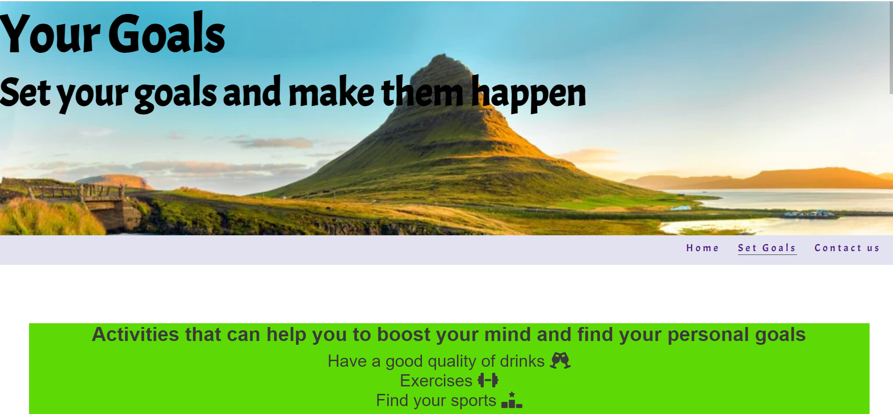
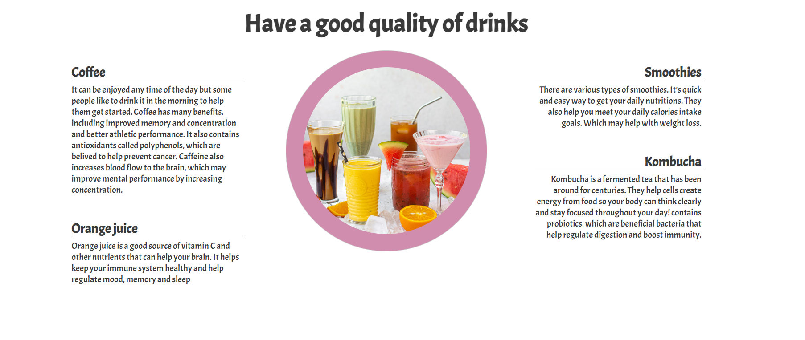
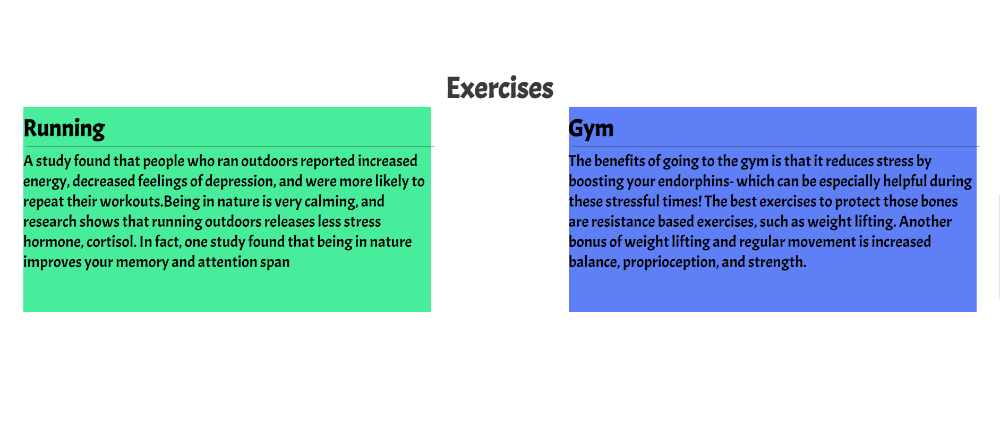
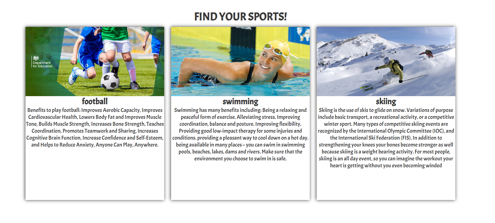
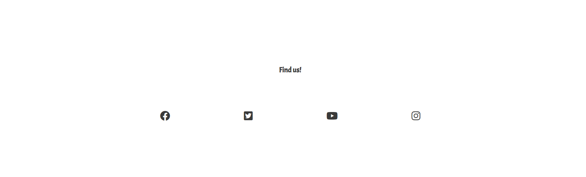

# Portfolio1 Project1

## first page and viewport for different devices

## Reprentation of first page

First page contain;

1.A picture to give a inspiration for better life titled "good life in Stockholm"

2.Four most popular and important figures, represent powerful self development skills.

3.Navigation bar.

## Represent of second page

Second page contain;

1.A picture to give a inspiration to set goals.

2.Navigation bar.

3.Represent some activity that can help to set main goals;

4.It's a good habit to have good drinks at the morning.

5. Second option is exercises. Represent two way to do exercises;

6. Third option is sports. Represent three types of sports;

## Footer

## Last page

1. This is a contact page where all of three element required;

2. Contain footer.

## Validator Testing

1. HTML
   No errors were returned when passing through the official W3C validator.

2. CSS
   No errors were found when passing through the official (Jigsaw) validator.

# content

1. (https://www.google.com/search?q=steve+jobs+speech+about+life&sxsrf=APwXEdcO7y6NV9DWvOF1pMr_q6CaqaudoQ%3A1688075419872&ei=m_ydZPflNKioxc8Pm72fyA4&oq=steve&gs_lcp=Cgxnd3Mtd2l6LXNlcnAQARgBMgQIIxAnMgcIIxCKBRAnMgcIIxCKBRAnMggIABCKBRCRAjIICAAQigUQkQIyCgguEIAEEBQQhwIyCwguEIAEEMcBENEDMgoILhCABBAUEIcCMgUILhCABDIFCC4QgAQ6CggAEEcQ1gQQsAM6BwgjEOoCECc6BwguEOoCECc6BwguEIoFEEM6BwgAEIoFEEM6DQguEIoFEMcBENEDEEM6BwguEIoFECc6CgguEIoFENQCEENKBAhBGABQ3gVYgD1gr1JoBXABeAKAAV-IAdATkgECMzeYAQCgAQGwAQrAAQHIAQg&sclient=gws-wiz-serp)
